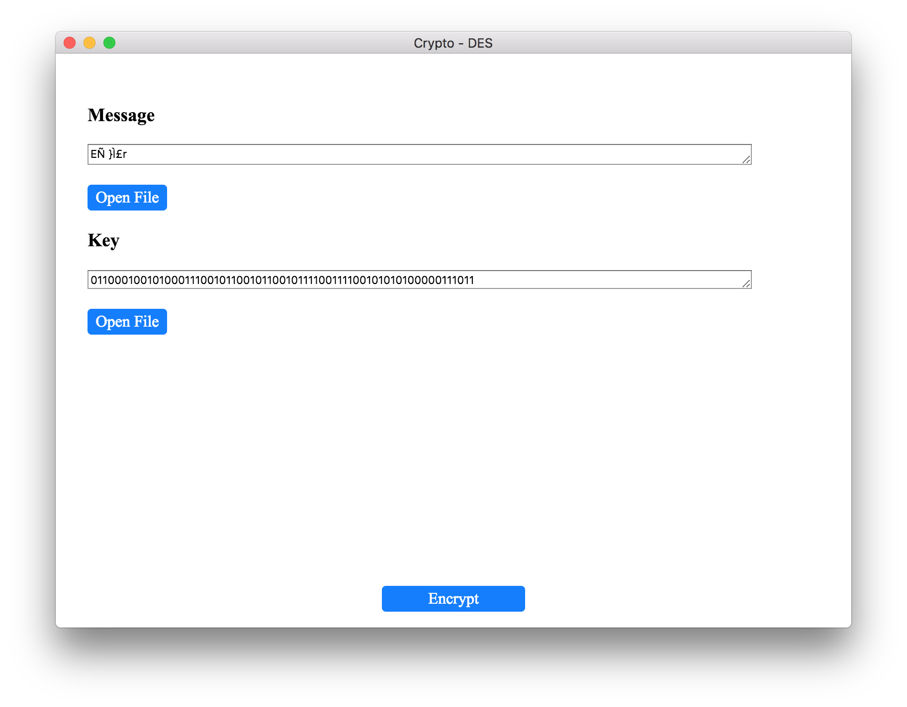
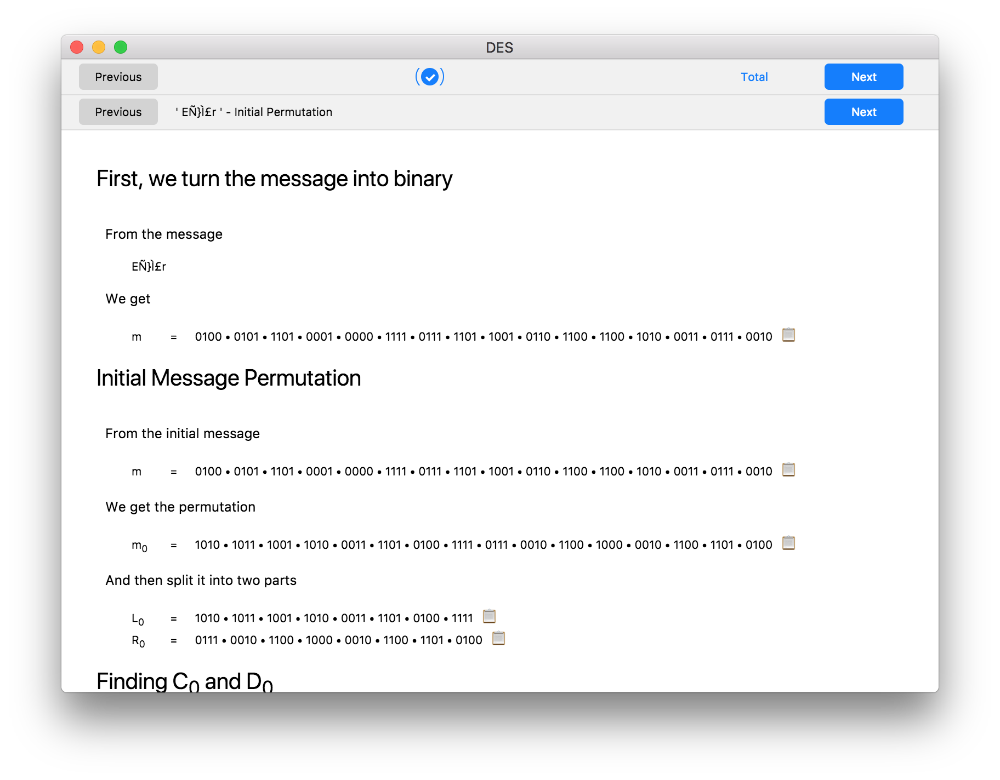
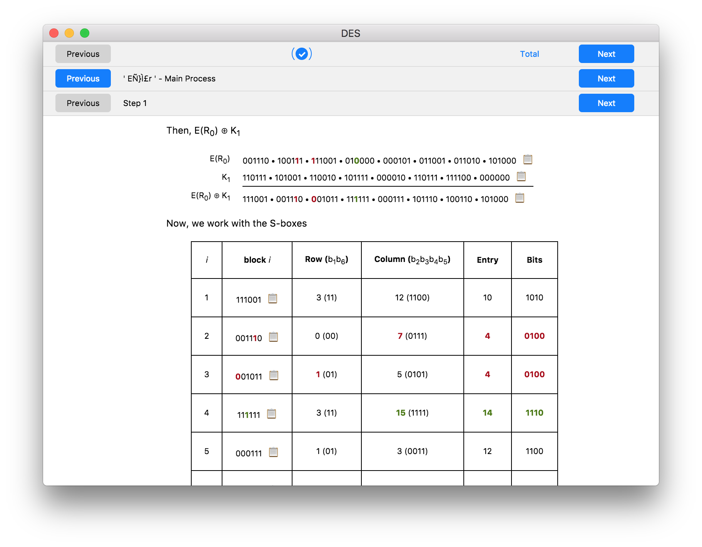
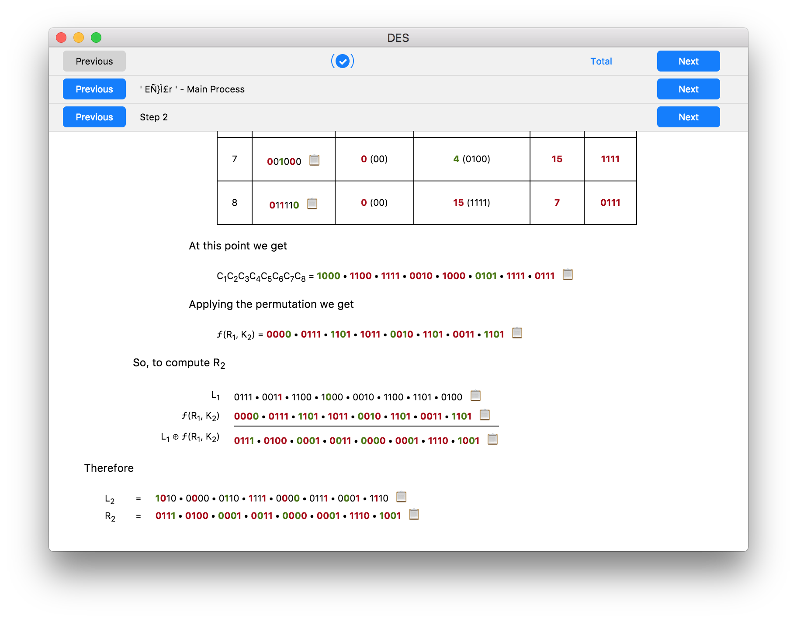
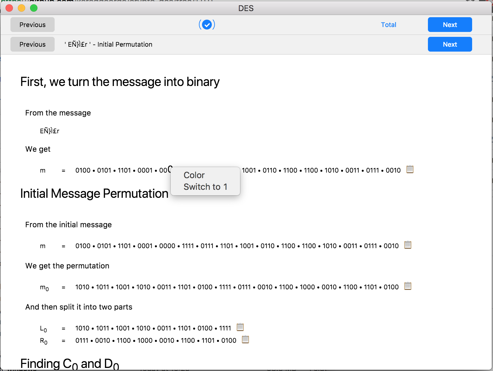

# Crypto DES

> Created as an assignment for a Cryptography class

# Features
- Goes through the entire DES encryption algorithm step by step showing all the intermediate parts and calculations
- Splits the message into 8 character blocks and encodes them separately
- Clicking on a bit and selecting `Color` will mark it with a shade of green along with all the future bits that depend on that
    - Shows the diffusion effect of DES
- Clicking on a bit and selecting `Switch` will flip it and mark it with a shade of red along with all the future bits that depend on that
    - Shows the diffusion effect of DES
    - Shows what the results and intermediate calculations would be if you messed up a bit if working through DES by hand
    
# Installation

> Downloads can be found under [Releases](https://github.com/karaggeorge/crypto-des/releases) 

### Windows
Download and run the executable

### Mac
Download and open the .dmg file

### Linux
Download and extract the zip file and run `crypto-des`

# Usage
- Select a message and key (either type or load from a file)
    - The default message/key match the example hand out given out in the class (allowed for easy checking)
- Press Encrypt
- Select the part of the message you are interested in using the top control bar, or select Total to see the entire message
- Select one of the three main steps of the DES algorithm using the second control bar
    - Initial Permutation
        - Turn message into binary
        - Perform the initial permutation
        - Calculate C0 and D0
    - Main Process
        - Perform the 16 DES rounds
    - Final Permutation
        - Reverse the two parts
        - Perform the inverse of the initial permutation
- Move through the 16 DES steps using the third control bar when viewing the Main Process
- Click the 📋 icon next to any block of bits to copy them to your clipboard
- Click any bit to select `Color` or `Switch`
- Save the resulting cipher in the Total page

# Screenshots

